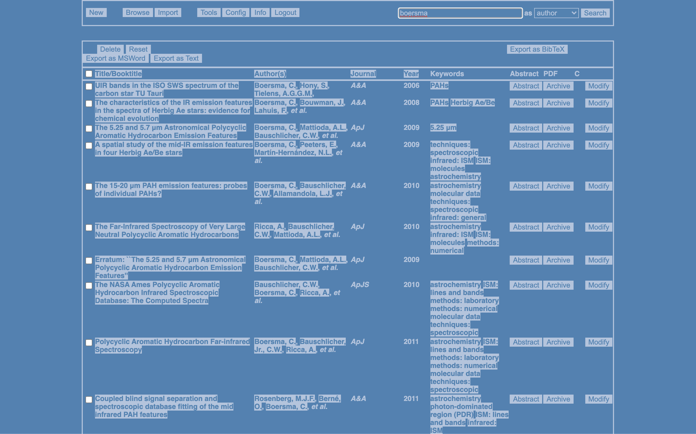

# Article Database

`Article Database` (`AdB`) is a searchable web-based citation and article (PDF) database application. `AdB` is written in C++ and relies on the [Common Gateway Interface](https://en.wikipedia.org/wiki/Common_Gateway_Interface) (`CGI`) for communication with its webserver. There is tight integration with the [NASA Astrophysics Data System](https://ui.adsabs.harvard.edu/) (`ADS`) using their web API ([free token needed](https://ui.adsabs.harvard.edu/user/account/login)). This allows easy importing of citations and papers (PDF) into `AdB`. In addition, citations can be imported using [DOIs](https://www.doi.org/), which relies on the services provided by [Crossref](https://www.crossref.org). Existing  [BibTeX](http://www.bibtex.org/Format/) bibliographies can be directly imported into `AdB` as well.

Citations can be exported as [BibTeX](http://www.bibtex.org/Format/), [MSWord](https://docs.microsoft.com/en-us/office/vba/word/concepts/working-with-word/working-with-bibliographies), and text. [PDFjs](https://mozilla.github.io/pdf.js/) is included to view article PDFs directly from within `AdB`.

Optionally, `AdB` translates [BibTeX](http://www.bibtex.org/Format/) journal abbreviations from a bibliography database file that provides mnemonics, e.g., those used by the [ADS](http://adsabs.harvard.edu/abs_doc/aas_macros.html).

There are a number of tools for organizing and maintaining `AdB`. These include a duplicates record finder, re-indexing, and a DOI finder for records missing one (via [crossref](api.crossref.org)). Furthermore, one can list all keywords and authors in present in `AdB`.

The look of `AdB` is theme-able, with a number of themes included by default.



## Usage

Building `AdB` requires the following to be available and/or installed:

1. `cmake`
2. `GNU` C++ compiler
3. `jemalloc`
4. `openssl`
5. `rapidjson`
6. `btparse`
7. `pkg-config`

The web application is build with:

```shell
mkdir build
cd build
cmake ../
make
```

This produces a directory called `adb` that should be moved into your web server root directory. Using a web browser you can then navigate to:

```shell
http://localhost/adb/index.cgi
```

and start using the application.

## Theming

`AdB` uses Cascading Stylesheet (`css`) theming. A number of themes are provided in the [plugins](web/plugins)-directory, which is a good place to  start your own theming.

## Notes

1. The PEM certificate file used by `AdB` defaults to `/private/etc/ssl/cert.pem`, change if needed under `Config→DOI CrossRef→PEM`.

## BSD-3 License

Redistribution and use in source and binary forms, with or without modification, are permitted provided that the following conditions are met:

1. Redistributions of source code must retain the above copyright notice, this list of conditions and the following disclaimer.

2. Redistributions in binary form must reproduce the above copyright notice, this list of conditions and the following disclaimer in the documentation and/or other materials provided with the distribution.

3. Neither the name of the copyright holder nor the names of its contributors may be used to endorse or promote products derived from this software without specific prior written permission.

THIS SOFTWARE IS PROVIDED BY THE COPYRIGHT HOLDERS AND CONTRIBUTORS "AS IS" AND ANY EXPRESS OR IMPLIED WARRANTIES, INCLUDING, BUT NOT LIMITED TO, THE IMPLIED WARRANTIES OF MERCHANTABILITY AND FITNESS FOR A PARTICULAR PURPOSE ARE DISCLAIMED. IN NO EVENT SHALL THE COPYRIGHT HOLDER OR CONTRIBUTORS BE LIABLE FOR ANY DIRECT, INDIRECT, INCIDENTAL, SPECIAL, EXEMPLARY, OR CONSEQUENTIAL DAMAGES (INCLUDING, BUT NOT LIMITED TO, PROCUREMENT OF SUBSTITUTE GOODS OR SERVICES; LOSS OF USE, DATA, OR PROFITS; OR BUSINESS INTERRUPTION) HOWEVER CAUSED AND ON ANY THEORY OF LIABILITY, WHETHER IN CONTRACT, STRICT LIABILITY, OR TORT (INCLUDING NEGLIGENCE OR OTHERWISE) ARISING IN ANY WAY OUT OF THE USE OF THIS SOFTWARE, EVEN IF ADVISED OF THE POSSIBILITY OF SUCH DAMAGE.
